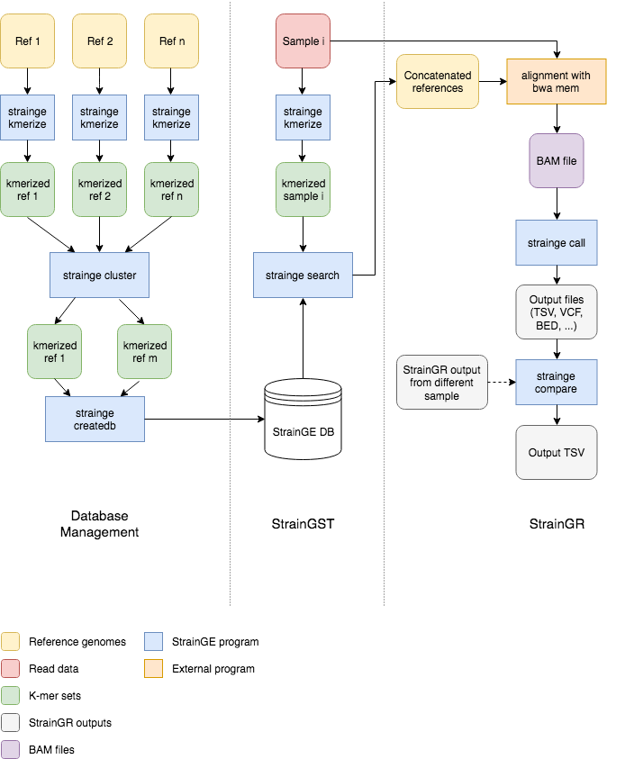

StrainGE: Strain-level Genome Exploration
=========================================

StrainGE is a set of tools to analyse the within-species strain diversity in 
bacterial populations. It consists of two main components: 1) StrainGST: Strain
Genome Search tool, a tool to find close reference genomes for strains present
in a sample and 2) StrainGR: Strain Genome Recovery, a tool to perform
strain-aware variant calling at low coverages.

Dependencies
------------

* Python >= 3.7
* NumPy
* SciPy
* matplotlib
* scikit-bio >= 0.5
* pyvcf
* pysam
* h5py
* intervaltree

These dependencies will be automatically installed when creating a conda
environment from our `environment.yml` file described below.

Installation
------------

1. Install Anaconda or miniconda (if not already present on your system)
2. Clone the repository:

    `git clone https://github.com/broadinstitute/StrainGE`

3. Move into the directory:

    `cd StrainGE`

4. Create a new conda environment:

    `conda env create -f environment.yml`

5. Activate the environment:

    `source activate strainge`

6. Install StrainGE:

    `python setup.py install` or `python setup.py develop` for developer mode.

**TODO**: create our own pip/conda packages for even easier installation.

Running StrainGE
----------------

A typical workflow using StrainGE is as follows:

1. Build a database of known strains covering the diversity for a species of
   interest.
2. Run StrainGST to identify close reference genomes to strains present in
   a sample.
3. Run StrainGR to call SNPs and other variants, and to compare strains across
   samples.

StrainGE is divided in two command line programs, `straingst` and `straingr`,
which in itself are divided into subcommands:

**Database creation**

* `straingst kmerize`
* `straingst kmersim`
* `straingst cluster`
* `straingst createdb`

**StrainGST: Strain Genome Search Tool**

* `straingst kmerize`
* `straingst run`

**K-mer set utilities**

* `straingst stats`
* `straingst plot`

**StrainGR: Strain Genome Recovery**

* `straingr prepare-ref`
* `straingr call`
* `straingr compare`
* `straingr dist`
* `straingr tree`
* `straingr view`


This tutorial will explain how to run each step and how everything is 
connected. A graphical overview of the pipeline can be seen below.



### StrainGST database creation

#### 1. Download high quality reference genomes for your genus/species of interest

This tutorial assumes you have activated the *strainge* conda environment.
The first step is to obtain high quality reference genomes for your genus or
species of interest, any method suffices. We've found the tool [ncbi-genome
-download](https://github.com/kblin/ncbi-genome-download) useful, and will
use that tool for this step. 

For example, to download all *Escherichia* genomes:

```bash
mkdir ref_genomes
ncbi-genome-download bacteria -l complete -g Escherichia,Shigella -H -F all \ 
    -o ref_genomes
```

The `-H` flag automatically organizes all downloaded files in a nice human
-readable folder structure. Besides downloading references, this command
downloads all associated metadata like gene annotations too, which is useful
for downstram analyses.

Next, we organize all references in a single directory using a script
available in the `bin/` directory of this repository: 
`prepare_strainge_db.py`. This script serves two main purposes: 1) it
organizes all references in a single directory, 2) it optionally splits
chromosomes and plasmids into separate files. When tracking strains we're
usually more interested in tracking the chromosome, and we don't want
StrainGST to report a strain as present because it shares a plasmid
(although its algorithm should already prevent most of those cases.)

So download the [prepare_strainge_db.py](https://github.com/broadinstitute/StrainGE/blob/master/bin/prepare_strainge_db.py)
script to your analysis folder, and run it as follows:
```bash
mkdir strainge_db
python3 prepare_strainge_db.py ref_genomes/human_readable -s \
    -o strainge_db > strainge_db/references_meta.tsv
```

The `-s` flag enables splitting chromosomes and plasmids. The file
`references_meta.tsv` contains metadata on each reference (for example its
accession no.)

#### 2. K-merize your reference sequences

Next, we k-merize each genome:

```bash
for f in strainge_db/*.fa.gz; do straingst kmerize -o $f.hdf5 $f; done;
```

The FASTA files with only chromosomes have a suffix of `*.chrom.fna.gz`. For
each FASTA file, there is now an accompanying HDF5 file containing the
k-mer data. With `-k` you can optionally specify a different k-mer size, which
by default is 23.

#### 3. Compare the k-mer sets and cluster similar references

The goal of StrainGST is to identify close reference genomes to strains present
in a sample. These reference genomes are in turn used for variant calling and
sample comparisons. Here lies a trade-off: the reference genome should be close
enough for accurate variant calling, but sample comparisons are more easy to
perform when the variant calling step is done using the same reference genome,
so you don't want to be too specific. Furthermore, limiting the database
size reduces computational time. The database of reference genomes should 
cover the diversity of the species of interest but not contain too many highly 
similar genomes. Therefore a clustering step is performed to reduce redundancy 
in the database.

We remove redundant reference genomes two ways:

1. Remove reference genomes that are a near perfect subset of another genome.
   An example of this is an *E. coli* strain used for synthetic biology
   applications that was basically a K-12 strain with many genes removed.
2. Cluster closely related genomes based on k-mer similarity and pick one 
   representative.

To do this, we need to compute the pairwise similarities between k-mer sets,
and a metric to identify whether a k-mer set is a subset of another. Both can
be obtained using `straingst kmersim`.

```bash
straingst kmersim --all-vs-all -t 4 -S jaccard -S subset strainge_db/*.hdf5 > similarities.tsv
```

This command produces as tab separated file, where each line contains
a pair of k-mer sets with their accompanying similarity scores. With the `-S`
flag we enable which scoring metrics to calculate, and in this case we enable
the *Jaccard* similarity and the *subset* score. The output file contains for 
each pair of k-mer sets the requested scores, sorted by the first scoring 
metric (in our case the jaccard similarity). With the parameter `-t` you 
specify the number of processes to spawn, to allow for parallel computation of 
these pairwise similarities.

We can now cluster our references using the `straingst cluster` command. 

```bash
straingst cluster -i similarities.tsv -d -C 0.99 -c 0.90 \
   --clusters-out clusters.tsv \
    strainge_db/*.hdf5 > references_to_keep.txt
```

The cluster command reads our previously created file `similarities.tsv` to
determine which references to keep. The first step is to discard any genome
where more than 99% of its kmers are present in another genome, as enabled by
`-d` and `-C 0.99`. Afterwards, we cluster similar genomes based on the
*Jaccard* similarity between k-mersets: if the Jaccard similarity between two
k-mer sets is higher than 0.90 (`-c 0.90`), those two genomes will be clustered 
together. For each cluster we pick one representative genome: the genome with 
the smallest mean distance to the other cluster members. Each genome to keep is
written to `references_to_keep.txt`. With the option `--clusters-out` we 
specify another file where we write the clustering results. Each line in this 
file specifies a cluster along with its entries, separated by a tab. The
genomes in the first column represent the cluster representatives. This option 
is optional, but can be useful for debugging purposes.

#### 4. Create pan-genome k-mer database

Using our list of references, we finally create a single database file which
will contain all k-mers of the given references. 

```bash
straingst createdb -f references_to_keep.txt -o pan-genome-db.hdf5
```

Now our database lives in the file `pan-genome-db.hdf5`, created from reference
sequences read from the file given by `-f`.

It is also possible to give the list of k-mer sets to include in the database
as positional arguments, like in the following example:

```bash
straingst createdb -o pan-genome-db.hdf5 ref1.hdf5 ref2.hdf5 ...
```

Combining the two methods described above works too.

### StrainGST: identify close reference genomes to strains in a sample

#### 1. k-merize your sample reads

With our database prepared, we can now analyse our samples, for example a 
metagenomic read data set from a patient. StrainGST uses k-mers to identify 
possible strains in your sample. Unsurprisingly, our first step is to kmerize 
our sample reads, for example if you have a FASTQ file named `patient1.fastq` 
with all the reads, then we generate its corresponding k-mer set as follows:

```bash
straingst kmerize -k 23 -o patient1.hdf5 patient1.fastq
```

Similar to the first step of the database creation section, this will generate 
a HDF5 file named `patient1.hdf5` with all k-mers and their corresponding 
counts. Make sure the value of `k` is the same as used in the 
database creation step.

You can specify multiple FASTQ files to the command above, which is useful if 
you have paired-end reads. Furthermore, it will also automatically decompress 
*gzipped* files. For example, if you have gzipped paired-end FASTQ files, then 
the following command also works:

```bash
straingst kmerize -k 23 -o patient1.hdf5 \
    patient1.1.fastq.gz patient1.2.fastq.gz
```

#### 2. Run StrainGST

We can now run `straingst run` with our database HDF5 and our sample HDF5:

```bash
straingst run -o results.tsv pan-genome-db.hdf5 patient1.hdf5
```

This will output a *tab separated values* (tsv) file, containing statistics 
about the sample k-mer set and a list of identified strains with accompanying 
statistics. For full description of all fields, please refer to the `straingst` 
reference documentation below.

### StrainGR: strain-aware variant calling and sample comparisons

#### 1. Prepare a concatenated reference FASTA with `straingr prepare-ref`

Our strategy to deconvolve strains in a mixture sample is to create a FASTA
containing a close reference genome for each strain present in a sample, and
then aligning the sample reads to this concatenated FASTA file. StrainGR
provides a tool `straingr prepare-ref` to automatically create and analyze
a concatenated reference genome from a list of StrainGST result files.

By including multiple reference genomes into a single FASTA file, a read
aligner will be able to place reads from unique portions of a strain's genome
to the right place. On the other hand, including more genomes into a single 
file will also introduce redundancy, from more conserved portions of each
strain's genome. In those regions, a read aligner may not be able to
unambiguously place reads. This is a trade-off: include as many reference
genomes as required to deconvolve strains in a sample, without combining too
closely related reference genomes that share a vast chunk of their genomes.

The `prepare-ref` subcommand aids in building a concatenated reference from
StrainGST result files. It determines which strains have been reported by
StrainGST, and performs another clustering step on the reported strains to
ensure the included reference strains are not too closely related. For 
example, sometimes it happens that a patient has a strain that's somewhat
in the middle between two reference genomes sitting next to each other on the
tree. Due to sampling noise, StrainGST may report one reference genome in one
sample, while reporting the other reference in the other sample with the same
strain, but taken at a different time point. Here the clustering step ensures
that only one of these two closely related strains gets included in the
concatenated reference.

After concatenating the selected references, `prepare-ref` runs `nucmer` from
the [MUMmer][mummer] toolkit to analyze how "repetitive" the concatenated
reference is, i.e. how much sequence do the genomes concatenated share. These
values are used to normalize strain abundances in a later step.

[mummer]: https://github.com/mummer4/mummer

To create a concatenated reference, use `straingr prepare-ref` as follows:

```bash
straingr prepare-ref -s path/to/straingst/*.tsv \
   -p "path/to/refdir/{ref}.fa.gz" \
   -S path/to/straingst_db/similarities.tsv
   -o refs_concat.fasta
```

We give multiple StrainGST TSV result files to `prepare-ref` with the `-s`
flag. Usually these are all StrainGST results file belonging to a single
patient, or an other related set of samples. Next, we need to specify how
`prepare-ref` can find the actual FASTA files belonging to strains reported by
StrainGST, this is done using the "path-template" switch `-p`: in this given
path "{ref}" will be replaced with the actual strain name. Don't forgot to use
quotes, because { and } are special characters in many shells. We specify the
similarities.tsv file created at the StrainGST database construction step, to
reuse the calculated k-mer similarities again for clustering. The resulting
concatenated reference will be written to `refs_concat.fasta`.

#### 2. Align reads to the reference

StrainGR is built to be used with `bwa mem`, as it uses the supplied 
information on alternative alignment locations encoded in the `XA` SAM tag to 
deal with shared regions introduced by concatenating reference genomes.

The following command aligns the reads with `bwa mem` and outputs a sorted BAM
file:

```bash
bwa mem -I 300 -t 2 refs_concat.fasta sample1.1.fq.gz sample1.2.fq.gz \
    | samtools sort -@ 2 -O BAM -o sample1.bam -

# Also create BAM index
samtools index sample1.bam
```

We specify a fixed insert size to `bwa mem`, because if the species of interest
in a metagenomic sample is at low abundance, there may be not enough reads per
batch for `bwa mem` to infer the mean insert size, and reads in such a batch 
will be marked as improperly paired. Optionally you can run `picard
MarkDuplicates` on your alignment file.

#### 3. Analyze read alignments to call variants

To call any variants in your sample run the StrainGR variant caller:

```bash
straingr call --hdf5-out sample1.hdf5 refs_concat.fasta sample1.bam
```

All variant calling data will be stored in the given HDF5 file
`sample1.hdf5`. When the variant caller is finished it will print a table with
summary statistics like coverage, SNP rate, gaps and more. You can also specify 
to output this table to a TSV file with the `-s` switch in the above command. 
There are more options for data output, it can output VCF files, BED tracks 
and more, see the CLI reference documentation below.

You can recreate many of the additional data files from the HDF5 file using
`straingr view`.

#### 4. Compare strains across samples

After running `straingr call` on a set of samples, it's possible to perform
strain-level comparisons. The following tools aid to analyze how closely
related strains across samples are:

* `straingr compare` - Nucleotide level comparisons of strains in different
   samples, outputs summary statistics.
* `straingr dist` - For all strains in samples close to a selected reference 
   genome, perform pairwise genetic distance estimation using Kimura's two
   parameter mode. Useful to create ordination plots.
* `straingr tree` - Using the distance matrix created by `straingr dist`,
   perform neighbour-joining to create an approximate phylogenetic tree.

CLI Reference Documentation
---------------------------

StrainGE has two main components, `straingst` and `straingr`, and each is
a separate program.

### Subcommand help

To view the documentation of each command line program, add the `-h` switch to
any subcommand. Examples:

```bash
straingst -h
straingst cluster -h
straingst run -h

straingr -h
straingr call -h
```

### Logging

StrainGE logs messages describing its current state to standard error. Its 
verboseness can be controlled using the `-v` switch, and this works for any of 
the commands described below. StrainGE has three verboseness levels. Please note 
that the `-v` switch needs to be set before any of the subcommands.

Examples:

```bash
straingst kmerize ...     # Only very global logging messages
straingst -v kmersim ...  # Get more internal logging messages
straingst -vv cluster ..  # Enable all debug messages
```
