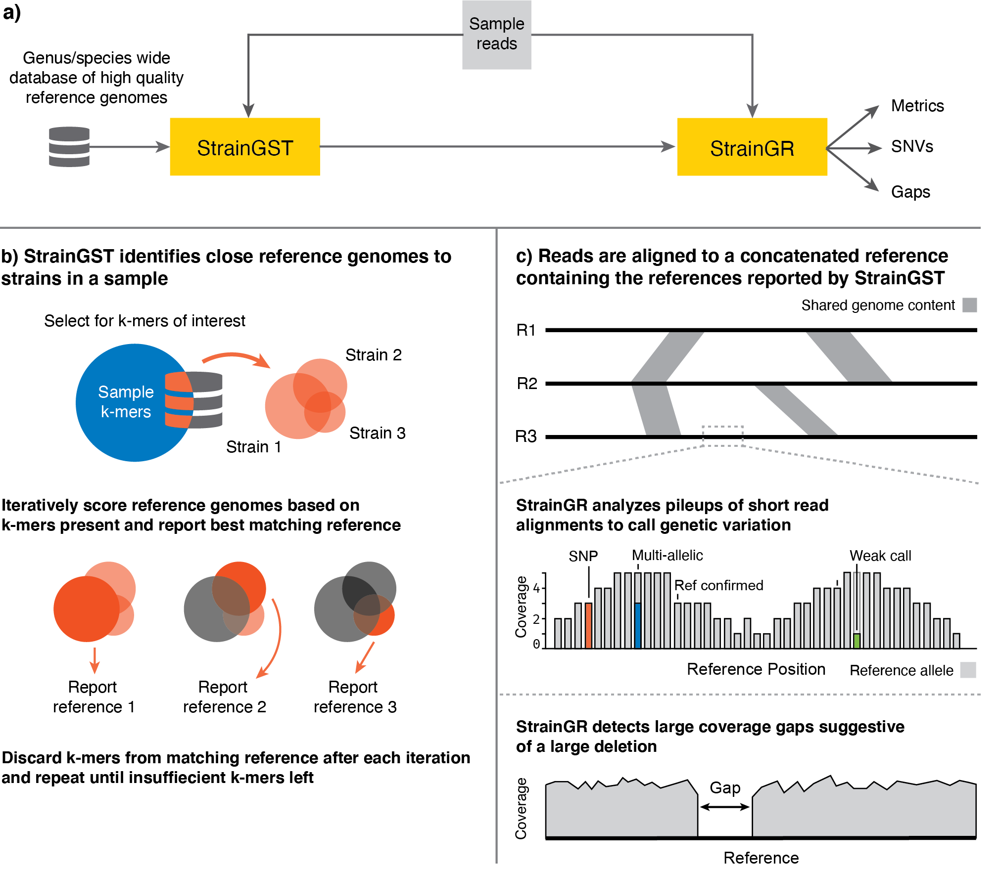

.. StrainGE documentation master file, created by
   sphinx-quickstart on Thu Jan 14 11:54:13 2021.
   You can adapt this file completely to your liking, but it should at least
   contain the root `toctree` directive.

========
StrainGE
========
A toolkit to track and characterize low-abundance strains using metagenomic data
--------------------------------------------------------------------------------

StrainGE is a set of tools to analyse conspecific strain diversity in
bacterial populations. It consists of two main components: 1) Strain
Genome Search tool (StrainGST), a tool to find close reference genomes to strain(s) present
in a sample and 2) Strain Genome Recovery (StrainGR), a tool to perform
strain-aware variant calling at low coverages, which in turn can be used to track strains across samples.

Installation
------------

StrainGE requires Python >= 3.7 and depends on the following packages:

* NumPy
* SciPy
* matplotlib
* scikit-bio
* pysam
* h5py
* intervaltree

These packages will be automatically installed when installing through pip.

Install through `pip`
=====================

.. code-block:: bash

   pip install strainge

Make sure `numpy` is already installed before installing StrainGE.

Install from bioconda
=====================

1. Create a new conda environment and activate it

   .. code-block:: bash

      conda create -n strainge python=3.9
      source activate strainge

2. Add bioconda and conda-forge channels

   .. code-block:: bash

      conda config --add channels bioconda
      conda config --add channels conda-forge

3. Install StrainGE

   .. code-block:: bash

      conda install strainge

Tip: also consider installing `Mamba <https://github.com/mamba-org/mamba>`_ for much faster conda operations.

Install manually from github
============================

1. Clone the repository

   .. code-block:: bash

      git clone https://github.com/broadinstitute/StrainGE

2. Install StrainGE

   .. code-block:: bash

      cd StrainGE
      python setup.py install

Usage
-----

.. toctree::
   :maxdepth: 1

   create-database
   straingst
   straingr
   compare-strains
   analysis

Citation
--------

If you use StrainGE in your project, please consider citing our publication:

   Dijk, Lucas R. van, Bruce J. Walker, Timothy J. Straub, Colin J. Worby, Alexandra Grote, Henry L. Schreiber, Christine Anyansi, et al. 2022. “StrainGE: A Toolkit to Track and Characterize Low-Abundance Strains in Complex Microbial Communities.” Genome Biology 23 (1): 74. https://doi.org/10.1186/s13059-022-02630-0.

Indices and tables
------------------

* :ref:`genindex`
* :ref:`modindex`
* :ref:`search`
